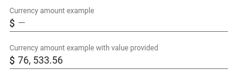

# \<etools-currency-input\>

A paper-input element that allows only currency amount values. It accepts only digits, comma, a
a single floating point (period), and allows 2 decimals. The maximum number you can enter is 999999999999.99.
The value displayed it's paper-input's internal value. The `value` property of this element will update and format
the internal value and when internal value is changed, element's value will be updated with current float value.



To only display values as currency amounts you can use `etoolsBehaviors.EtoolsCurrencyBehavior` 
`displayCurrencyAmount` method.

### Element properties

* autoValidate, Boolean, default: false
* currency, string
* disabled, Boolean, default: false
* errorMessage, String, default: 'This field is required'
* invalid, Boolean, default: false
* label, String
* placeholder, String, default: '—'
* readonly, Boolean, default: false
* required, Boolean, default: false
* value, String, notifies, converted to float value on internal value change

## Usage

```html
<etools-currency-amount-input label="Amount value"
    value="{{value}}" currency="$"></etools-currency-amount-input>
```

## Styling

Use this css mixins to style this element.
All mixins are used to override the same mixin of paper-input.

Custom property | Description | Default
----------------|-------------|----------
`--etools-currency-input` | Mixin applied to currency element | `{}`
`--etools-currency-container-input` | Mixin applied to paper-input container input | `{}`
`--etools-currency-container-label` | Mixin applied to paper-input label | `{}`
`--etools-currency-container-label-focus` | Mixin applied to paper-input label when it's focused | `{}`
`--etools-currency-container-label-floating` | Mixin applied to paper-input label when it floats | `{}`
`--etools-currency-container-underline` | Mixin applied to the paper-input underline | `{}`
`--etools-currency-container-underline-focus` | Mixin applied to the paper-input underline when it's focused | `{}`
`--etools-currency-container-underline-disabled` | Mixin applied to the paper-input underline when it's disabled | `{}`

## Install

```bash
$ bower install --save etools-currency-input
```

## Preview element locally

Install needed dependencies by running: `$ bower install`.
Make sure you have the [Polymer CLI](https://www.npmjs.com/package/polymer-cli) installed. Then run `$ polymer serve` to serve your element application locally.

## Running Tests

You need to have `web-component-tester` installed (if not run `npm install -g web-component-tester`)
```bash
$ wct
```
or 
```bash
$ wct -p
```
